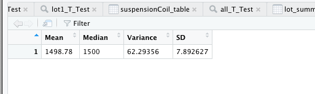
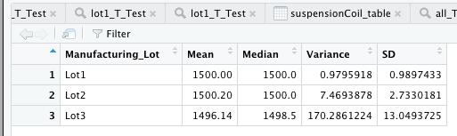
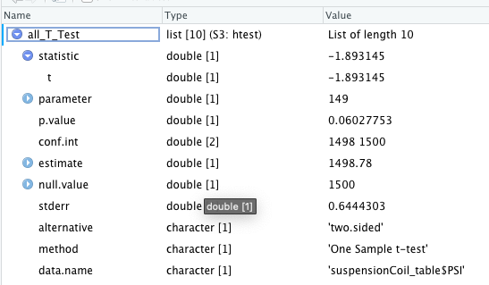
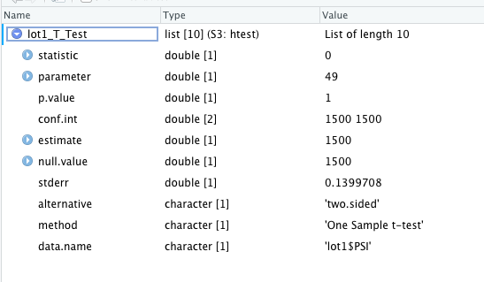
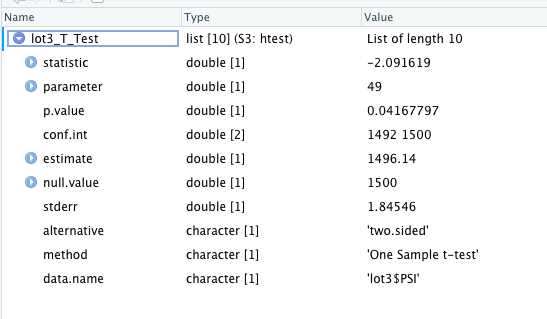

# MechaCar_Statistical_Analysis

## Linear Regression to Predict MPG
After performing the multivariable linear regression on the mpg dataset the results are located in figure 1. .  Notice that there are three variables with non-random amounts of variance:
1. Vehicle Length
2. ground clearance
3. Intercept

The slope of the model is not zero as the p-value is less than 0.05 and is listen in figure 1 as 5.35 x 10^-11.  The model does a fair job of predicting at the multiple r squred value is .7149.  There remains additional variables that are not accounted for in the model.  We do need to be carefule to avoid over fitting the model.

##  Summary Statistics on Suspension Coils

Three lots of the suspension coils were analyzes for their summary statistics using R.  As seen in figure 2 , when grouped together all lots are within the variance of 100 psi as the variance is at 62 psi.  However when looking at individual lots in figure 3  Lot 1 and Lot 2 have variances of less than the design specification of 100 psi.  Lot 3 however fails to meet this specification as its variance is greater than 100 psi at 170 psi.  Lot 3 fails to meet design specifications. 

## T-Tests on Suspension Coils

T-Tests were performed to evaluate the suspension parameters of the the entire sample set vs the population mean of 1500 psi.  In addition, each of the 3 lots were also T.tested agains the population mean of 1500 psi.  Figure 4  show the the p-value to be greater (0.06 vs target of 0.05) indicating the total lots are statistically similar to the population average.  As we saw in the previous summary statistics when we look at the values on the T-test by lots we see that lot 3 has a mean that is statistically different than the pouplation mean.  Lot 1 results are in Figure 5 .  Lot 2 results are in Figure 6 .  Finally Lot 3 results are in Figure 7 .

## Study Design: MechaCar vs Competition

